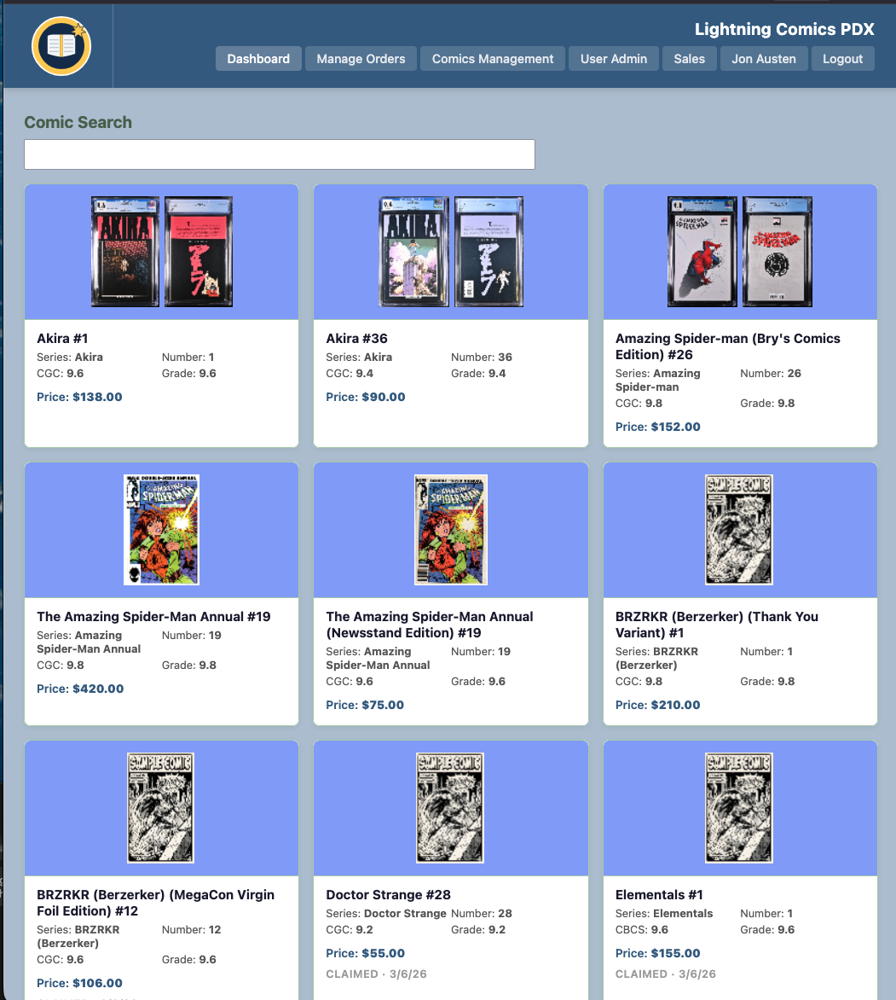

# Comic Claim Sale App

A full-stack web application for managing a personal comic book collection and running **claim sales** — a selling format where buyers claim items from a posted list on a first-come, first-served basis.



---

## Repository Structure

| Folder | Description |
|---|---|
| `comic-book-db/` | Angular 16 frontend — SPA deployed to Azure Static Web Apps |
| `fn-comic-db/` | Java 17 Azure Functions backend — REST API deployed to Azure Function App |

---

## Features

- **Dashboard** — browsable grid of comics for sale with cover thumbnails, grade, and price
- **Claim system** — buyers claim comics into a cart; first-come, first-served with conflict prevention
- **Real-time notifications** — polling-based toast broadcasts for claim, award, and return events
- **Cart lifecycle** — `OPEN → FINALIZING → FINALIZED → FULFILLED` with a 24-hour review window
- **Order archive** — fulfilled orders are permanently archived and survive database resets
- **Admin tools** — inline-editable comic grid (AG Grid), order management, user admin, discount rules
- **Discount engine** — flat percentage, buy-X-get-one-free, and stacking percentage-per-X-books rules
- **Cover images** — front and back cover upload with auto-generated thumbnails stored in Cosmos DB
- **PIN-based auth** — custom session system; no third-party identity provider

---

## Tech Stack

| Layer | Technology |
|---|---|
| Frontend | Angular 16, AG Grid, Azure Static Web Apps |
| Backend | Java 17, Azure Functions, Jackson |
| Database | Azure Cosmos DB (7 containers) |
| Auth | Custom PIN + SHA-256, session tokens in Cosmos |
| Images | Base64-encoded in Cosmos, resized via Apache Commons Imaging |

---

## Getting Started

### Backend (`fn-comic-db/`)

```bash
cd fn-comic-db
mvn clean package
mvn azure-functions:run        # runs locally at http://localhost:7071
```

### Frontend (`comic-book-db/`)

```bash
cd comic-book-db
npm install
npm start                      # dev server at http://localhost:4200
```

> To develop against the local backend, uncomment the `localhost:7071` base URL in `ComicService`.

---

## Deployment

See [`comic-book-db/DEPLOY.md`](./comic-book-db/DEPLOY.md) and [`fn-comic-db/DEPLOY.md`](./fn-comic-db/DEPLOY.md) for full deployment instructions.